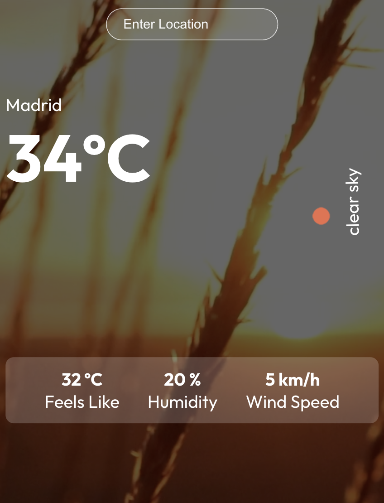

#   Weather App

This is a simple weather app that allows users to check the weather conditions for a specific location.




## Features

- Users can enter a location to get the current weather information.
- The app displays the temperature, weather description, weather icon, feels like temperature, humidity, and wind speed for the provided location.

- The background of the app includes a video showing a beautiful sunset scene.

## Technologies Used

- React: A JavaScript library for building user interfaces.
- Axios: A popular HTTP client for making API requests.
- OpenWeatherMap API: Used to fetch weather data based on the location entered by the user.

## How to Use
 - Clone this repository to your local machine.

``````
git clone https://github.com/MMurilloP/Weather-App-React-JS.git
``````

- Install the dependencies.

``````
cd weather-app
npm install
``````

- Get an API key from OpenWeatherMap by signing up for a free account.

- Create a file named .env in the root directory of the project and add your API key.

``````
REACT_APP_API_KEY=your-api-key
``````

- Start the development server.
``````
npm start
``````

- Open your browser and navigate to http://localhost:3000 to use the app.


## License

This project is licensed under the MIT License - see the LICENSE file for details.


